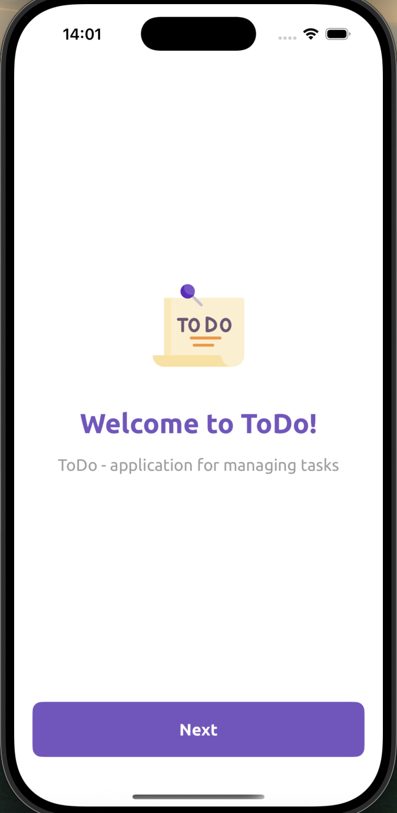
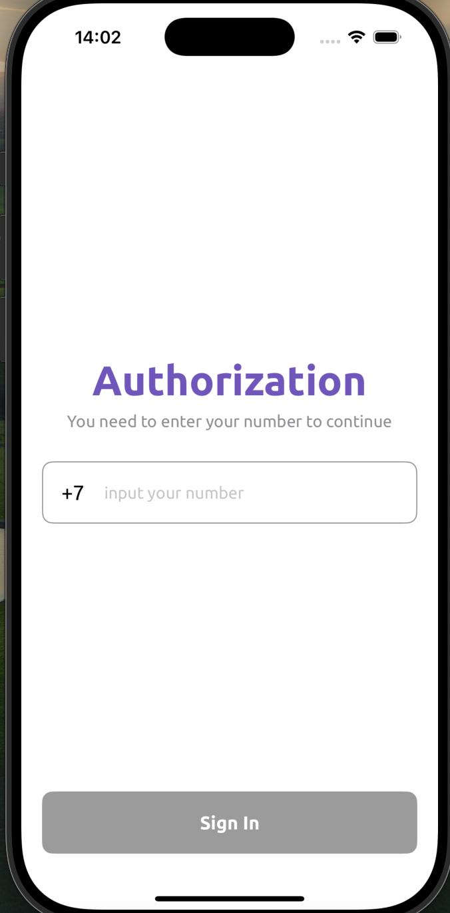

# Project 12. "ToDo"

### Реализовано два экрана с использованием SwiftUI

В проекте анимация между переходами экранов, используются кастомный шрифт и цвета, реализовано
покрытие unit-тестами. Предусмотрены ночная и дневная версии. 

 
